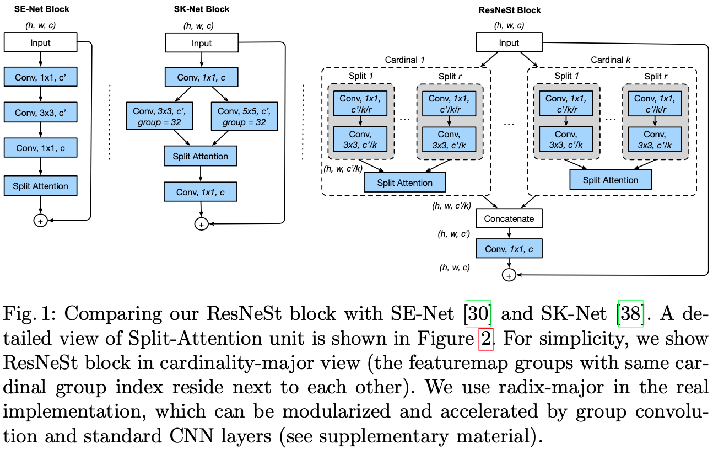
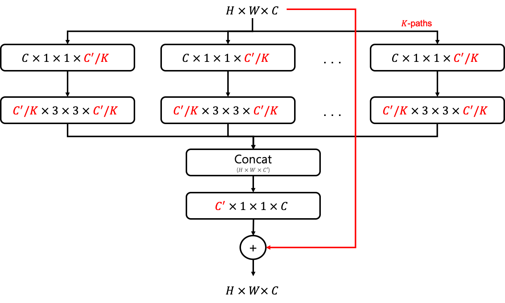
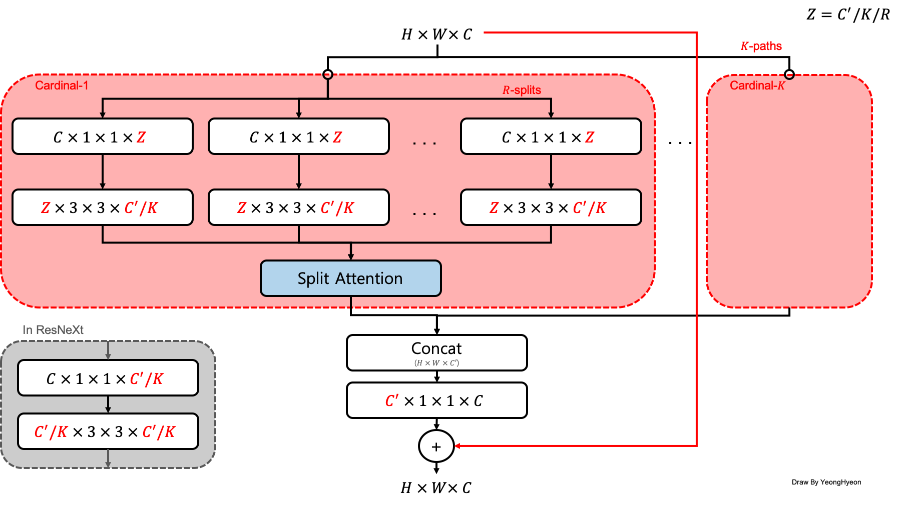
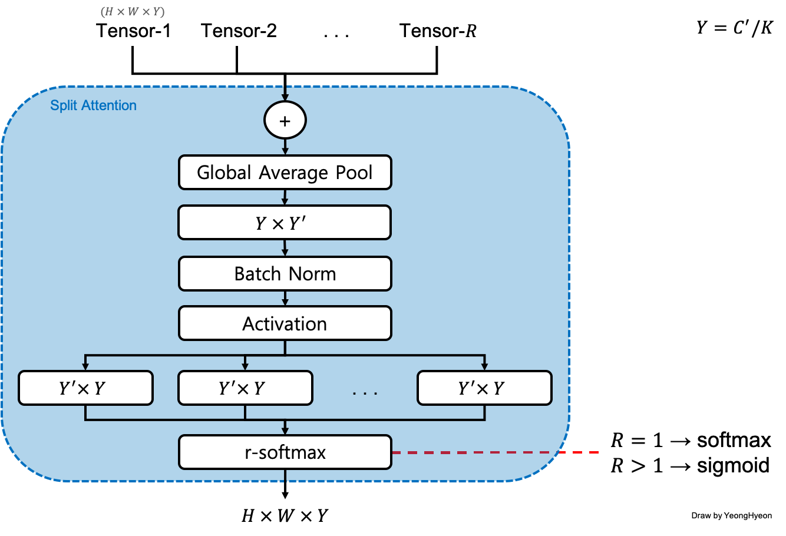

[TensorFlow 2] ResNeSt: Split-Attention Networks
=====

TensorFlow implementation of "ResNeSt: Split-Attention Networks"  

## Related Repositories
<a href="https://github.com/YeongHyeon/ResNet-TF2">ResNet-TF2</a>  
<a href="https://github.com/YeongHyeon/ResNeXt-TF2">ResNeXt-TF2</a>  
<a href="https://github.com/YeongHyeon/WideResNet_WRN-TF2">WideResNet(WRN)-TF2</a>  
<a href="https://github.com/YeongHyeon/ResNet-with-LRWarmUp-TF2">ResNet-with-LRWarmUp-TF2</a>  
<a href="https://github.com/YeongHyeon/ResNet-with-SGDR-TF2">ResNet-with-SGDR-TF2</a>  

<a href="https://github.com/YeongHyeon/SENet-Simple">SE-Net</a>  
<a href="https://github.com/YeongHyeon/SKNet-TF2">SK-Net</a>  

## Concept
<div align="center">
    
  <p>Comparing SE-Net, SK-Net, and ResNeSt [1].</p>
</div>

<div align="center">
    
  <p>ResNeXt Remind</p>
</div>

<div align="center">
    
  <p>ResNeSt Diagram</p>
</div>

<div align="center">
    
  <p>Split-Attention in ResNest</p>
</div>

## Performance

|Indicator|Value|
|:---|:---:|
|Accuracy|0.99130|
|Precision|0.99123|
|Recall|0.99138|
|F1-Score|0.99129|

```
Confusion Matrix
[[ 979    0    0    0    0    0    0    1    0    0]
 [   0 1118    0    3    2    0    2    5    5    0]
 [   0    1 1027    0    0    0    1    3    0    0]
 [   0    0    0 1007    0    2    0    0    1    0]
 [   0    0    0    0  977    0    2    0    0    3]
 [   0    0    0    3    0  885    1    1    1    1]
 [   7    1    0    0    0    1  949    0    0    0]
 [   0    2    3    0    0    0    0 1021    0    2]
 [   3    0    4    1    0    3    3    0  958    2]
 [   2    1    1    0    8    2    1    1    1  992]]
Class-0 | Precision: 0.98789, Recall: 0.99898, F1-Score: 0.99340
Class-1 | Precision: 0.99555, Recall: 0.98502, F1-Score: 0.99026
Class-2 | Precision: 0.99227, Recall: 0.99516, F1-Score: 0.99371
Class-3 | Precision: 0.99310, Recall: 0.99703, F1-Score: 0.99506
Class-4 | Precision: 0.98987, Recall: 0.99491, F1-Score: 0.99238
Class-5 | Precision: 0.99104, Recall: 0.99215, F1-Score: 0.99160
Class-6 | Precision: 0.98957, Recall: 0.99061, F1-Score: 0.99009
Class-7 | Precision: 0.98934, Recall: 0.99319, F1-Score: 0.99126
Class-8 | Precision: 0.99172, Recall: 0.98357, F1-Score: 0.98763
Class-9 | Precision: 0.99200, Recall: 0.98315, F1-Score: 0.98756

Total | Accuracy: 0.99130, Precision: 0.99123, Recall: 0.99138, F1-Score: 0.99129
```

## Requirements
* Python 3.7.6  
* Tensorflow 2.1.0  
* Numpy 1.18.1  
* Matplotlib 3.1.3  

## Reference
[1] Hang Zhang et al. (2020). <a href="https://arxiv.org/abs/2004.08955">ResNeSt: Split-Attention Networks</a>. arXiv preprint arXiv:2004.08955.
